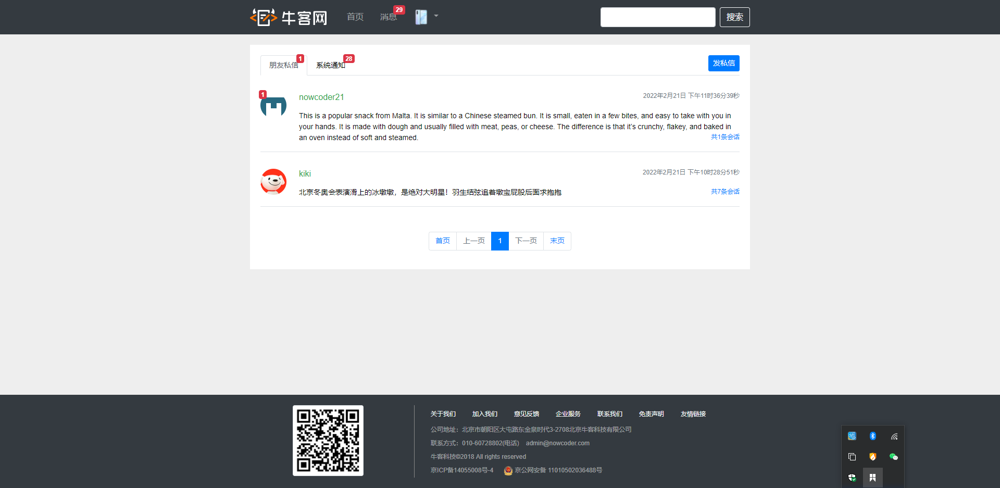

# 牛客网论坛项目

#### 介绍

牛客网论坛项目是一个基于分布式的java论坛类项目，使用主流的spring boot开发，代码整洁规范化。具有牛客社区论坛的主要功能。此外还有一些新功能正在开发中。

##### 开发环境

- 构建工具：[Apache Maven](http://maven.apache.org)
- 集成开发工具：IntelliJ IDEA
- 数据库：MySQL、[Redis](https://redis.io/)
- 应用服务器：[Apache Tomcat](https://tomcat.apache.org/)
- 版本控制工具：Git

##### 技术栈

| 软件名称      | 描述               | 版本              |
| ------------- | ------------------ | ----------------- |
| Spring Boot   | 开源框架           | 2.1.5.RELEASE     |
| Spring        | 开源框架           | 2.1.5.RELEASE     |
| Spring Mail   | Spring邮件模块     | 2.1.5.RELEASE     |
| MyBatis       | ORM框架            | 2.0.1             |
| MySQL         | 数据库             | 8.0.16            |
| Kafka         | 消息中间件         | 2.2.6.RELEASE     |
| Redis         | 缓存数据库         | 2.1.5.RELEASE     |
| Git           | 版本控制工具       | 2.20.0.windows.1` |
| Elasticsearch | 搜索引擎           | 2.1.5.RELEASE     |
| Thymeleaf     | 模板引擎           | 2.1.5.RELEASE     |
| Swagger       | 接口文档生成工具   | 3.0.0             |
| kaptcha       | 验证码工具         | 2.3.2             |
| fastjson      | json对象转换工具包 | 1.2.75            |
| quartz        | 定时任务框架       | 2.3.0.RELEASE     |
| caffeine      | 缓存框架           | 2.7.0             |
| 七牛云OSS     | OSS服务器          | 7.2.23            |

#### 软件架构

软件架构图


软件架构说明

| 软件名称         | 作用                                                         |
| ---------------- | ------------------------------------------------------------ |
| Spring Boot      | 简化开发                                                     |
| Spring           | 系统开发核心                                                 |
| Spring MVC       | 前后端请求交互处理                                           |
| Spring Mybatis   | 后端ORM                                                      |
| Spring Security  | 安全框架，管理用户认证和授权(权限控制)                       |
| Spring Mail      | 系统邮件客户端                                               |
| Redis            | 缓存用户数据、点赞数据、帖子数据等                           |
| kafka            | 系统消息队列，数据同步消息队列                               |
| Elasticsearch    | 全文搜索引擎，存储帖子数据，提供帖子数据搜索服务，支持中文分词 |
| quartz           | 定时任务                                                     |
| caffine          | 本地缓存，缓存热门帖子数据                                   |
| 七牛云存储服务器 | 图片服务器                                                   |

#### 功能概览


#### 演示图

|  |
| ------------------------------------------ |
|  |
|  |
|  |
|  |
|  |
|  |


#### 安装教程

1. 克隆项目

   ```git
   git clone 项目git地址
   ```

2. 执行sql数据库脚本

   

3. 修改yml配置文件

4. 安装并启动kafka

5. 安装并启动es,其中必须安装ik中文分词器

6. 安装并启动redis

7. 启动项目，访问网址:http://localhost:8088/community/index

#### 使用说明

1.  xxxx
2.  xxxx
3.  xxxx

#### 参与贡献

1.  Fork 本仓库
2.  新建 Feat_xxx 分支
3.  提交代码
4.  新建 Pull Request


#### 特技

1.  使用 Readme\_XXX.md 来支持不同的语言，例如 Readme\_en.md, Readme\_zh.md
2.  Gitee 官方博客 [blog.gitee.com](https://blog.gitee.com)
3.  你可以 [https://gitee.com/explore](https://gitee.com/explore) 这个地址来了解 Gitee 上的优秀开源项目
4.  [GVP](https://gitee.com/gvp) 全称是 Gitee 最有价值开源项目，是综合评定出的优秀开源项目
5.  Gitee 官方提供的使用手册 [https://gitee.com/help](https://gitee.com/help)
6.  Gitee 封面人物是一档用来展示 Gitee 会员风采的栏目 [https://gitee.com/gitee-stars/](

